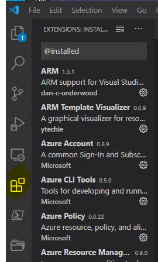

# 1. Prepare and configure your local VS Code installation

After downloading and installing the latest VS Code version on your local maschine, you have a huge choice of extensions for making your work much easier.

For the current project you should consider extensions for:

- ARM Templates
- Terraform code
- Git extension pack
- Markdownlint (checking syntax of *.md files when documenting on GitHub etc..)

## Preparing VS Code:
1. Step: Make sure Git version control is enabled under Settings
2. Step: To pull and push the changes within your project you need to add your GitHub repo under "Ctrl+Shift+P" Add remote (add the URL of your repo) 
