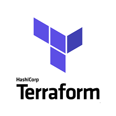

# Terraform IAC Starter Project

This repository gives some simple examples about setting up an environment to start your first IAC (Infrastructure as Code) project.  

## 1. Let's prepare our working environment and the respective tools

- VS Code - You can download from [here](https://code.visualstudio.com/Download)
- Terraform - You can download Terraform [here](https://www.terraform.io/downloads.html)
- Azure CLI - You can download Azure CLI (windows/Linux) [here](https://docs.microsoft.com/bs-latn-ba/cli/azure/install-azure-cli?view=azure-cli-latest)
- Git - Here you can install Git version control on your local maschine [here](https://git-scm.com/downloads)
- GitHub - Open a GitHub account and create a repository [here](https://github.com/)

The following chapters will guide you through the process on how to get started in regards to the working environment and outline some example deployments. This will give you a basic undertanding of immutable infrastrucure in Azure using Terraform and GitHub.

### Details - Tools setup

- [A - VS Code preperation](./docs/vscode_prepare.md)
- [B - Terraform installation](./docs/terraform_prepare.md)
- [C - Azure CLI installation](./docs/azurecli_prepare.md)
- [D - Git version control installation](./docs/git_prepare.md)
- [E - Getting started on GitHub.com](./docs/github_prepare.md)

optional Tools

- [F - Windows subsystem for Linux - WSL2 on your Windows 10 maschine](./docs/wsl_prepare.md)
- [G - Using Ansible as configuration management tool](./docs/ansible_prepare.md)

## 2. Starting the first Terraform project

Starting off into the IAC world with Terraform means getting some best practices in place. A good strating point is a a book or reference guide. From my personal experience, I would tend to [Terraform: Up & Running, 2nd Edition](https://www.terraformupandrunning.com/) by Yevgeniy (Jim) Brikman.
